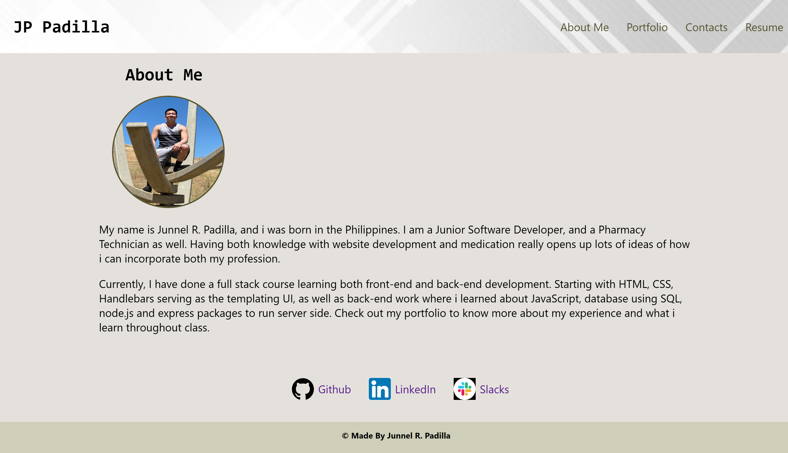
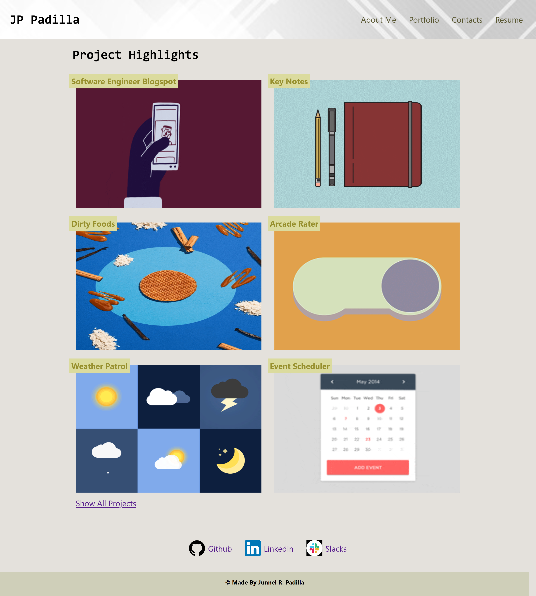
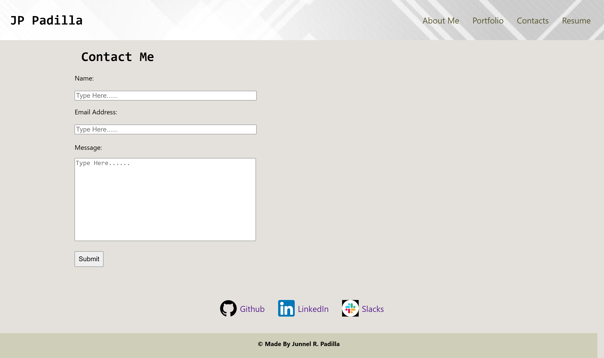

# Project Portfolio 

# Table of Contents
* [Usage](#usage)
* [Description](#usage)
* [URL](#URL)
* [Screenshots](#Screenshots)
* [Contributors](#contributors)
* [License](#license)
* [Contacts](#contacts)
  
## Usage
This apps purpose to store projects, contact information, resume and a description about me
  
## Description
This app includes a landing page where information about me will be displayed, as well as a separate page for portfolio which will include my projects. This will also include a contact page where all my social media, linkedIn accounts will be stored and finally a resume page that is available for download.
  
## URL 

## Screenshots
About Me

Portfolio

Contact Page

## Contributors
Junnel R. Padilla, UC Berkeley Bootcamp Modules
  
## License
This project is licensed under [MIT](https://opensource.org/licenses/MIT)

## Questions?
* Name: Junnel R. Padilla
* Github: https://github.com/jayP308
* LinkedIn: https://www.linkedin.com/in/jp-padilla-038854251/